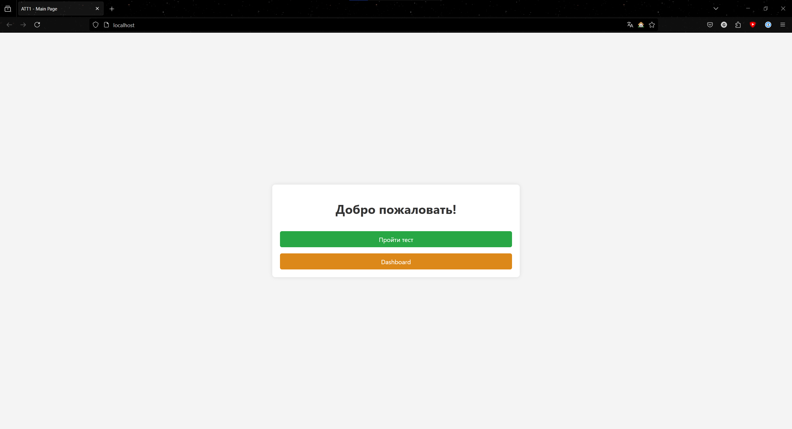

# Лабораторная работа №6: Взаимодействие контейнеров
## Цель работы
Выполнив данную работу студент сможет управлять взаимодействием нескольких контейнеров.

## Задание
Создать php приложение на базе двух контейнеров: nginx, php-fpm.

## Подготовка
Для выполнения данной работы необходимо иметь установленный на компьютере Docker.

Для выполнения работы необходимо иметь опыт выполнения лабораторной работы №3.

## Выполнение
### `mounts/site` + PHP приложение
В директории containers06 создайте директорию mounts/site. В данную директорию перепишите сайт на php, созданный в рамках предмета по php.

Я добавил приложение из альтернативной аттестаци по PHP, которое реализовывает опросник с админ-панелью и так далее.

### .gitignore
Создайте файл `.gitignore` в корне проекта и добавьте в него строки:

```bash
# Ignore files and directories
mounts/site/*
```
### nginx conf
Создайте в директории `containers06` файл `nginx/default.conf` со следующим содержимым:

```nginx
server {
    listen 80;
    server_name _;
    root /var/www/html;
    index index.php;
    location / {
        try_files $uri $uri/ /index.php?$args;
    }
    location ~ \.php$ {
        fastcgi_pass backend:9000;
        fastcgi_index index.php;
        fastcgi_param SCRIPT_FILENAME $document_root$fastcgi_script_name;
        include fastcgi_params;
    }
}
```

## Запуск и тестирование
### Сеть internal
Создайте сеть internal для контейнеров^

```bash
docker network create internal
```
Вывод:
```bash
b9bc1e4a966e37c1f0ffa5487d99d97b822b88d7fdc61564dc322489bbbbdc2d
```
### Контейнер backend
Создайте контейнер `backend` со следующими свойствами:

- на базе образа `php:7.4-fpm`;
- к контейнеру примонтирована директория `mounts/site` в `/var/www/html`;
- работает в сети `internal`.

```powershell 
docker run -d `
  --name backend `
  --network internal `
  -v "$(pwd)/mounts/site:/var/www/html" `
  php:7.4-fpm
```

- ` - используется для переноса строк в Powershell;
- `-d` — запуск в фоновом режиме;
- `--name backend` — имя контейнера (будет использоваться в nginx-конфиге);
- `--network internal` — подключаем к сети `internal`;
- `-v ...` — монтируем папку с PHP-кодом в контейнер;
- `php:7.4-fpm` — образ для PHP-FPM.;

### Контейнер frontend
Создайте контейнер frontend со следующими свойствами:

- на базе образа `nginx:1.23-alpine`;
- с примонтированной директорией `mounts/site` в `/var/www/html`;
- с примонтированным файлом `nginx/default.conf` в `/etc/nginx/conf.d/default- conf`;
- порт 80 контейнера проброшен на порт 80 хоста;
- работает в сети `internal`.

```Powershell
docker run -d `
  --name frontend `
  --network internal `
  -v "$(pwd)/mounts/site:/var/www/html" `
  -v "$(pwd)/nginx/default.conf:/etc/nginx/conf.d/default.conf" `
  -p 80:80 `
  nginx:1.23-alpine
```
### Проверка запущенных контейнеров
```Powershell
PS C:\Users\grxxndxxm\Documents\USM\CV\containers06> docker ps
CONTAINER ID   IMAGE               COMMAND                  CREATED          STATUS          PORTS                NAMES
b9dea841f7b5   nginx:1.23-alpine   "/docker-entrypoint.…"   11 seconds ago   Up 11 seconds   0.0.0.0:80->80/tcp   frontend
4a19688202fd   php:7.4-fpm         "docker-php-entrypoi…"   3 minutes ago    Up 3 minutes    9000/tcp             backend
```
### Проверка работоспособности сайта
Переходим в браузере по адресу `http://localhost/`

Наблюдаем, что сайт полностью работает и всё хорошо:


### Вывод
В ходе выполнения работы было успешно развернуто PHP-приложение с использованием двух контейнеров:

- Nginx (frontend) — обрабатывает HTTP-запросы и передаёт PHP-скрипты в FastCGI.

- PHP-FPM (backend) — исполняет PHP-код и возвращает результат Nginx.

Что было достигнуто:

1. Создана изолированная сеть `internal` для безопасного взаимодействия контейнеров.

2. Настроено монтирование кода (через `-v`), что позволяет изменять файлы на хосте без пересборки контейнеров.

3. Проброшен порт 80 контейнера Nginx на хост, что сделало приложение доступным по `http://localhost`.

Проверена работоспособность:

- Сайт отображается без ошибок.
- Контейнеры работают без ошибок.

Ключевые выводы:

1. Docker-сети позволяют контейнерам общаться по именам (`backend`, `frontend`), что удобнее IP-адресов.

2. Разделение сервисов (Nginx + PHP-FPM) соответствует лучшим практикам микросервисной архитектуры.

Docker эффективен для развертывания многоконтейнерных приложений, а правильная настройка сети и томов — залог стабильности их работы.

# Ответы на вопросы

1. **Каким образом в данном примере контейнеры могут взаимодействовать друг с другом?**  

Контейнеры взаимодействуют через Docker-сеть `internal`. В файле `nginx/default.conf` указано `fastcgi_pass backend:9000`, что означает, что Nginx (frontend) отправляет PHP-запросы к контейнеру `backend` (php-fpm) по его имени в сети. Docker автоматически разрешает имена контейнеров внутри одной сети.

2. **Как видят контейнеры друг друга в рамках сети `internal`?**  

В сети `internal` контейнеры могут обращаться друг к другу по **имени контейнера** и по **алиасу**. Docker предоставляет встроенный DNS-сервер, который преобразует эти имена в IP-адреса внутри сети.

3. **Почему необходимо было переопределять конфигурацию Nginx?**  

Стандартная конфигурация Nginx не знает, как обрабатывать PHP-запросы и куда их перенаправлять. В переопределённом `default.conf`:
- Указан корневой каталог (`root /var/www/html`).
- Настроено перенаправление PHP-запросов к `backend:9000` (php-fpm).
- Добавлены параметры FastCGI для корректной работы с PHP (например, `SCRIPT_FILENAME`).  

Без этих настроек Nginx не смог бы работать с PHP-скриптами.